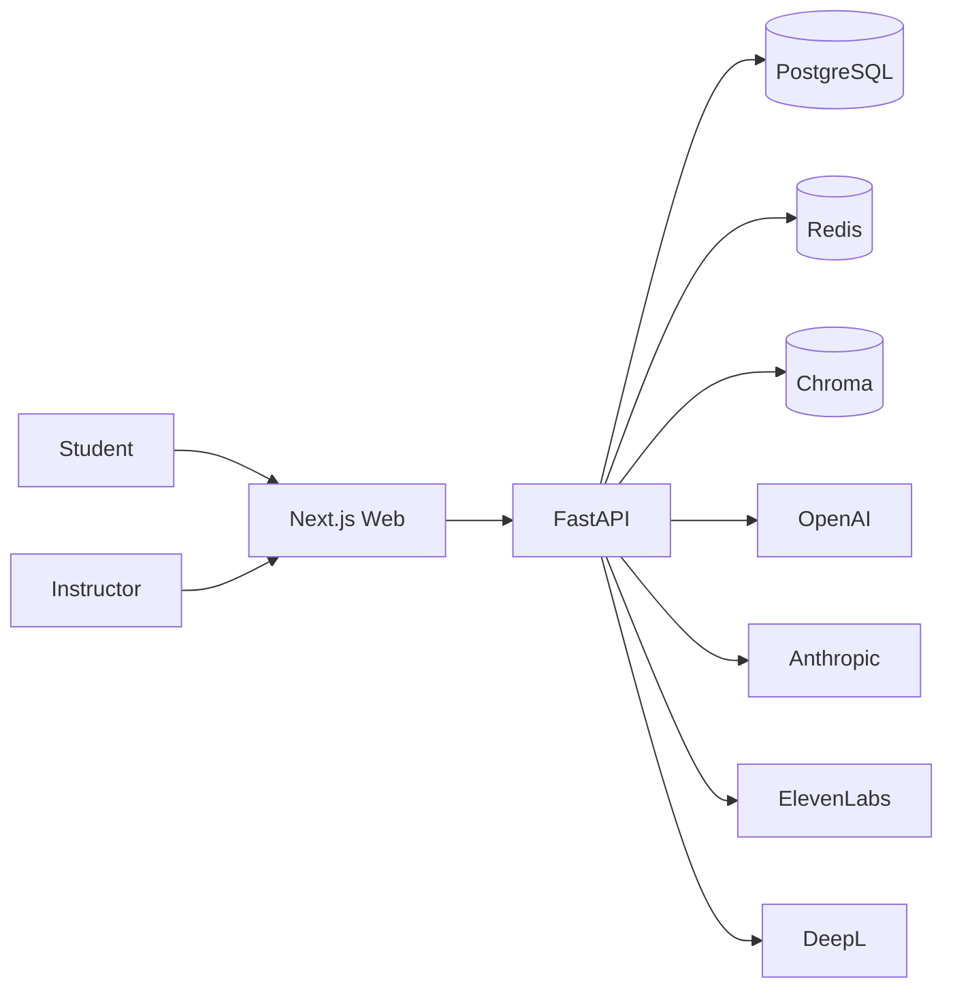

# Architecture

The platform is split into a web application, an API application, durable stores, and provider adapters.

## Web

`apps/web` owns the user experience: landing pages, authentication, student workflows, instructor workflows, and the voice assistant interface. The web app talks to the API through `NEXT_PUBLIC_API_URL`.

## API

`apps/api` owns data, auth, AI orchestration, ingestion, quiz generation, and analytics. Provider SDK usage is kept in `app/services/providers.py` so the rest of the application can depend on stable internal interfaces.

## Data Stores

- PostgreSQL stores users, courses, lessons, conversations, progress, quizzes, and analytics facts.
- Chroma stores course-material chunks and vector embeddings.
- Redis is reserved for request caching and background-job coordination.

## AI Workflow

1. The student submits voice or text.
2. Voice is transcribed through the transcription provider.
3. The query is embedded and matched against Chroma chunks.
4. The LLM receives the retrieved context and generates an explanation.
5. Optional translation and TTS are applied.
6. Messages, citations, and learning signals are persisted for progress and instructor analytics.
